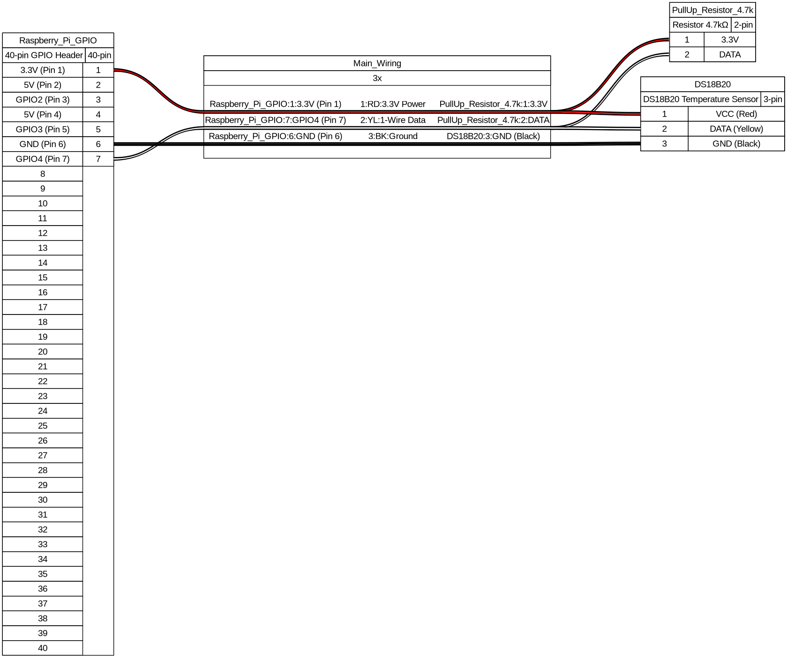

# 🌡️ RPi64 Alpine Diskless Temperature Probe (`rpi64-alpine-diskless-probe`)

[](https://github.com/atlantic-zone/rpi64-alpine-diskless-probe/actions/workflows/build-release.yml)
[](https://github.com/atlantic-zone/rpi64-alpine-diskless-probe/actions/workflows/security-scan.yml)
[](https://www.raspberrypi.com/)
[](https://alpinelinux.org/)

Standalone **Alpine Linux Diskless (100% RAM / tmpfs)** system distribution for Raspberry Pi 3, 4, and 5 (`aarch64` / `rpi64`) powered by **Telegraf** with 1-Wire DS18B20 temperature sensor probe and **Dual Metric Exporter Engine (Prometheus PULL + VictoriaMetrics / InfluxDB PUSH)**.

---

## 🚀 Key Features

- **100% Run-from-RAM (Diskless):** The entire system operates in memory (`tmpfs`). Zero write operations occur on the SD card during runtime, completely eliminating SD card corruption risks caused by power outages.
- **Powered by Industrial Telegraf Engine:** Standardized telemetry collection powered by Telegraf plugins (`inputs.temp`, `inputs.system`, `inputs.cpu`, `inputs.mem`, `inputs.disk`, `inputs.net`).
- **Universal RPi 3, 4 & 5 Compatibility:** Built on Alpine Linux `aarch64` (64-bit), natively supporting Raspberry Pi 3B/3B+, Raspberry Pi 4B, and Raspberry Pi 5.
- **Dual Metric Engine (PULL + PUSH):**
  - **Prometheus PULL Exporter:** Served on `http://<IP>:9100/metrics` via Telegraf's `outputs.prometheus_client`.
  - **VictoriaMetrics PUSH:** HTTP POST Prometheus ingestion (`/api/v1/import/prometheus`).
  - **InfluxDB PUSH:** Native InfluxDB Line Protocol HTTP POST ingestion.
- **Simple FAT32 Configuration (`probe.conf`):** All parameters (`HOSTNAME`, `LOCATION`, `VICTORIAMETRICS_URL`, `INFLUXDB_URL`, `TIMEZONE`, `KEYMAP`, `STATIC_IP`, `WIFI_SSID`) are configured via a plain text file on the FAT32 root partition of the SD card.
- **Automatic SSH Provisioning:** Dynamic fetch and injection of authorized SSH public keys via URL (supports single or multiple URLs).
- **Wi-Fi & Ethernet Support:** Automatic fallback to Wi-Fi (`WIFI_SSID` / `WIFI_PASSWORD`) or Ethernet RJ45 connection (DHCP or Static IP).
- **Embedded Admin Utilities:** Includes `telegraf`, `vim`, `tmux`, `curl`, `openssh`, `tzdata`, `kbd-bkeymaps`, and `wpa_supplicant`.

---

## 🔌 Hardware Wiring Specifications & WireViz Diagram

Connect the **DS18B20 digital 1-Wire temperature sensor** to the Raspberry Pi 40-pin GPIO header:

| Wire Color | Signal Name | Description | RPi Header Connection |
| :--- | :--- | :--- | :--- |
| **RED** | `VCC` | Power (3.3V DC) | **Pin 1** (`3.3V Power`) |
| **BLACK** | `GND` | Ground | **Pin 6** or **Pin 9** (`GND`) |
| **YELLOW** | `DATA` | 1-Wire Data Line | **Pin 7** (`GPIO 4 / GPCLK0`) |

> ⚠️ **CRITICAL LOGIC LEVEL WARNING:** Never connect the Red (VCC) wire to 5V (Pin 2 or Pin 4). DS18B20 sensors and Raspberry Pi GPIO pins operate strictly on **3.3V logic levels**. Connecting 5V to GPIO 4 will destroy the GPIO port!

### Electronic Wiring Harness Diagram (Generated via WireViz):



```text
       Raspberry Pi Header (40-Pin)
       ---------------------------
       Pin 1 (3.3V) ───────┬────────────────────────────────────── Sensor RED (VCC)
                           │                               
                         [4.7kΩ] Resistor (Yellow-Violet-Red-Gold)
                           │                               
       Pin 7 (GPIO4)───────┼────────────────────────────────────── Sensor YELLOW (DATA)
                           │                               
       Pin 6 (GND)  ───────┴────────────────────────────────────── Sensor BLACK (GND)
```

> 💡 **Pull-Up Resistor Requirement:** A **4.7 kΩ pull-up resistor** (1/4W, color code: Yellow-Violet-Red-Gold) is required between the **RED (3.3V)** line and the **YELLOW (DATA)** line for 1-Wire signal integrity.

---

## 🛠️ SD Card Preparation Guide (macOS CLI / Terminal)

On **macOS Terminal**, using raw disk devices (`/dev/rdiskX`) provides **10x to 20x faster** formatting and I/O operations by bypassing kernel buffer caching:

### 1. Identify your SD Card device
```bash
diskutil list
```
*(Identify your SD Card device identifier, e.g. `/dev/disk2` or `/dev/disk3`).*

### 2. Fast Format SD Card to FAT32 (using raw disk `rdiskX`)
```bash
# Bypasses kernel buffer cache for maximum speed (replace rdiskX with your device, e.g. rdisk2)
diskutil eraseDisk FAT32 RPIPROBE MBRFormat /dev/rdiskX
```

### 3. One-Liner Download & Extract to `/Volumes/RPIPROBE`
```bash
curl -sSL "https://github.com/atlantic-zone/rpi64-alpine-diskless-probe/releases/latest/download/rpi64-alpine-diskless-probe-latest.tar.gz" | tar -xzf - -C /Volumes/RPIPROBE/
```

### 4. Edit `probe.conf` & Eject
```bash
nano /Volumes/RPIPROBE/probe.conf
diskutil eject /dev/diskX
```

---

## 📖 Complete `probe.conf` Variables Reference

| Section | Variable Name | Required | Default | Description / Value Format |
| :--- | :--- | :---: | :---: | :--- |
| **Metrics** | `HOSTNAME` | **Yes** | `rpi-probe-01` | Hostname of the Raspberry Pi. |
| | `LOCATION` | **Yes** | `unspecified` | Geographic / room location tag sent to VictoriaMetrics/InfluxDB. |
| | `INTERVAL_SECONDS` | No | `10` | Frequency of metric collection and push (in seconds). |
| | `GPIO_PIN` | No | `4` | GPIO Pin used for 1-Wire Data Line. |
| **Exporter**| `ENABLE_PULL_SERVER` | No | `true` | Enables Telegraf Prometheus PULL Exporter on port **9100**. |
| **Push** | `VICTORIAMETRICS_URL` | No | *None* | HTTP Prometheus import endpoint (`/api/v1/import/prometheus`). |
| | `INFLUXDB_URL` | No | *None* | InfluxDB Line Protocol HTTP write endpoint (`/api/v2/write`). |
| | `INFLUXDB_TOKEN` | No | *None* | InfluxDB v2 API Token. |
| | `INFLUXDB_ORG` | No | *None* | InfluxDB Organization Name. |
| | `INFLUXDB_BUCKET` | No | *None* | InfluxDB Target Bucket Name. |
| **Regional** | `TIMEZONE` | No | `Europe/Paris` | System timezone (e.g. `Europe/Paris`, `UTC`). |
| | `KEYMAP` | No | `us-intl` | Console keyboard layout (`us-intl`, `us`, `fr`, `es`). |
| **Access** | `SSH_KEYS_URL` | No | *None* | Space-separated list of URLs to fetch public SSH keys from. |
| | `ROOT_PASSWORD` | No | *None* | Optional password for direct HDMI/Keyboard local root console access. |
| **Network** | `STATIC_IP` | No | *DHCP* | Static IPv4 address (e.g. `10.0.0.150`). Leave blank for DHCP. |
| | `NET_MASK` | No | `255.255.255.0` | Subnet mask for static IP. |
| | `NET_GATEWAY` | No | `.1` of IP | Default gateway IP for static configuration. |
| | `DNS_SERVERS` | No | *System* | Space-separated list of DNS servers (e.g. `"1.1.1.1 8.8.8.8"`). |
| **Wi-Fi** | `WIFI_SSID` | No | *None* | Wi-Fi network SSID (leave blank if connected via RJ45). |
| | `WIFI_PASSWORD` | No | *None* | Wi-Fi WPA2 password. |
| | `WIFI_COUNTRY` | No | `FR` | Two-letter ISO country code for Wi-Fi regulatory domain. |

---

## 🔍 Verification & Diagnostics

Once the Raspberry Pi boots:

1. **Scrape local Telegraf Prometheus PULL exporter:**
   ```bash
   curl -sS http://localhost:9100/metrics
   ```
2. **Inspect raw 1-Wire sensor output locally:**
   ```bash
   cat /sys/bus/w1/devices/28-*/w1_slave
   ```
3. **Verify Telegraf status:**
   ```bash
   rc-service telegraf status
   ```
4. **Verify root filesystem is 100% RAM:**
   ```bash
   df -h /
   # Expected output: tmpfs on /
   ```

---

## 📜 Notice

Copyright (c) 2026 Atlantic Zone / Strategic Zone. All rights reserved.
